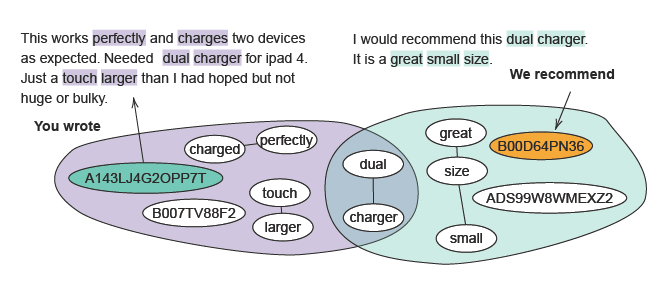

## Case study

**Fig. 1:** *Case study with random sampled user.*

We consider here an exemplar case study ([Fig 1.](case_study.pdf)) by
randomly selecting a user (`A143LJ4G20PP7T`}) and providing an explanation for the highest-ranked item (`B00D64PN36`).
The user has reviewed an item with dual-charging functionality. 
Our graph restriction method limits our method to reviews using such terms, thereby finding a review explicitly stating it is a dual-charger.
Furthermore, the user has stated that `B007...` is a bit larger, while the review of the recommended item praises its small size. 
As such, we are able to infer user `A143...` likes dual chargers, item `ADS9...` is a great smaller dual charger which we assume the user to like.
Our graph view shows the intersection: being dual charger and the keywords of the item, great, small charger. 
As such, our method selects the relevant information for the user, and this can then be adopted  for word-level highlighting of the parts of text in review of the recommended item.